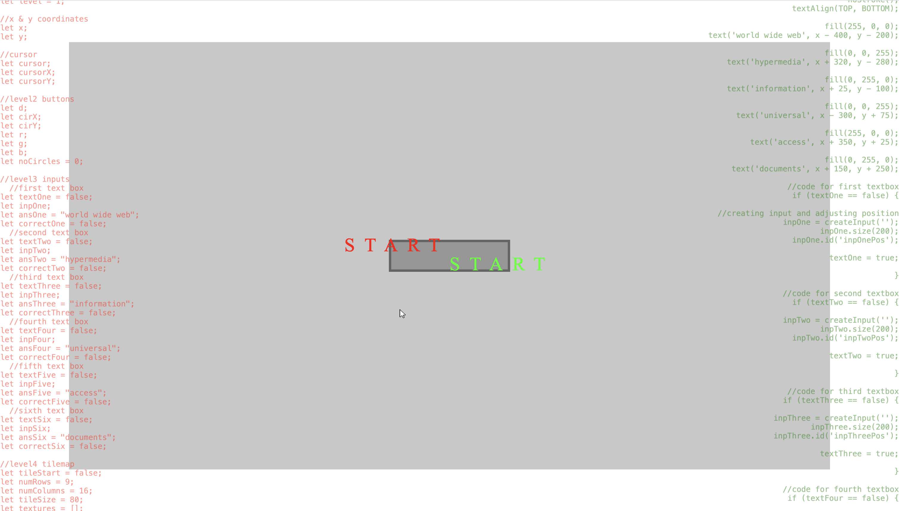

# Not What You Think Of

An explanation of the how users experience or interact with your project and any objectives.

"Not What You Think Of" showcases a series of challenges that loops forever. Users will have to attempt to solve the problems with their keyboard and mouse. There will not be an end goal to achieve or last level to reach. Users will have to keep completing tasks to experience all the challenges available. After each tasks, there would be physical instructions that users are able to follow along if they are able to.  The option of refreshing the page is always available if users feel stuck or would like to try again.  
The main objective for the users is to experience the bodily interactions when using interfaces. They should be aware of the way they move while completing the task or following the instructions. The project aims to unlearn the muscle memories of users when using the mouse and keyboard to navigate through the interface. 