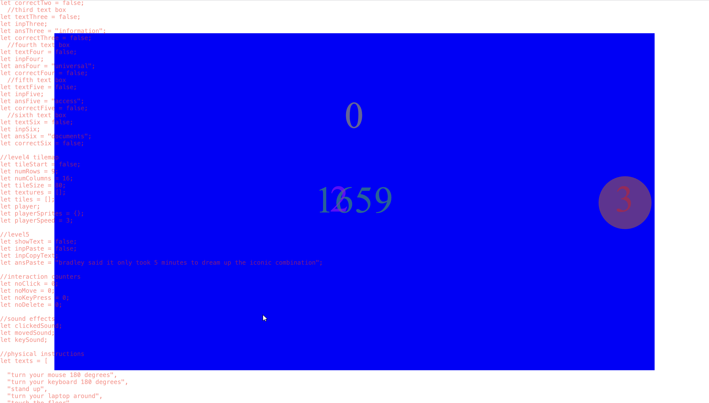
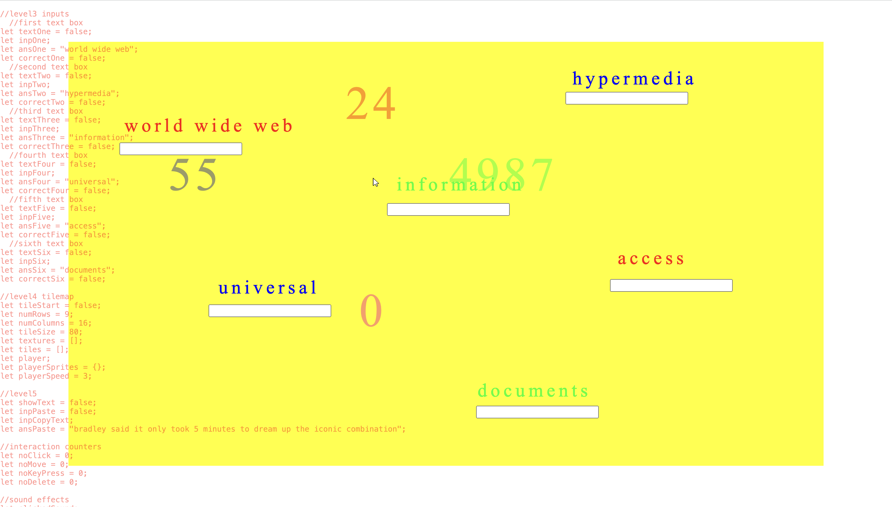
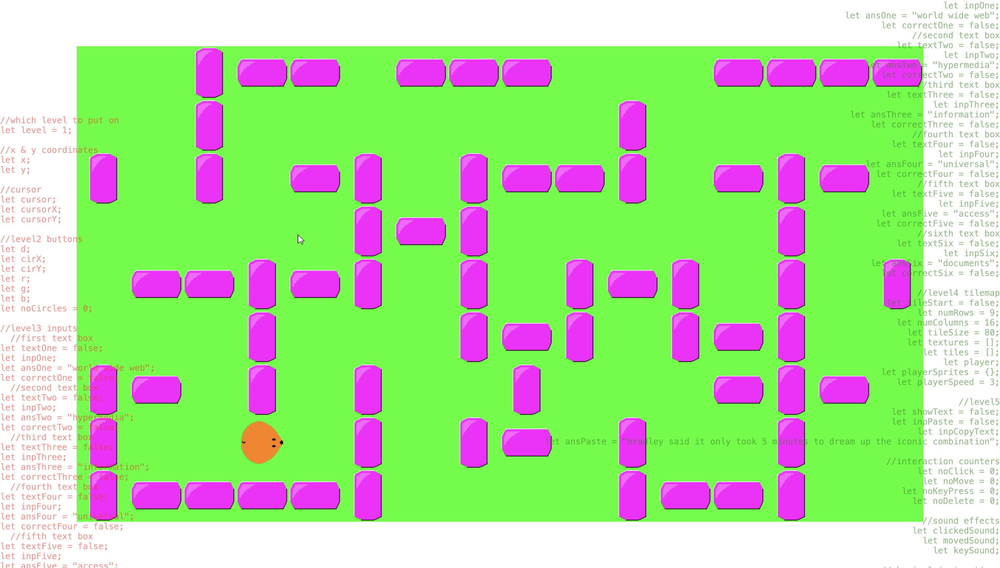
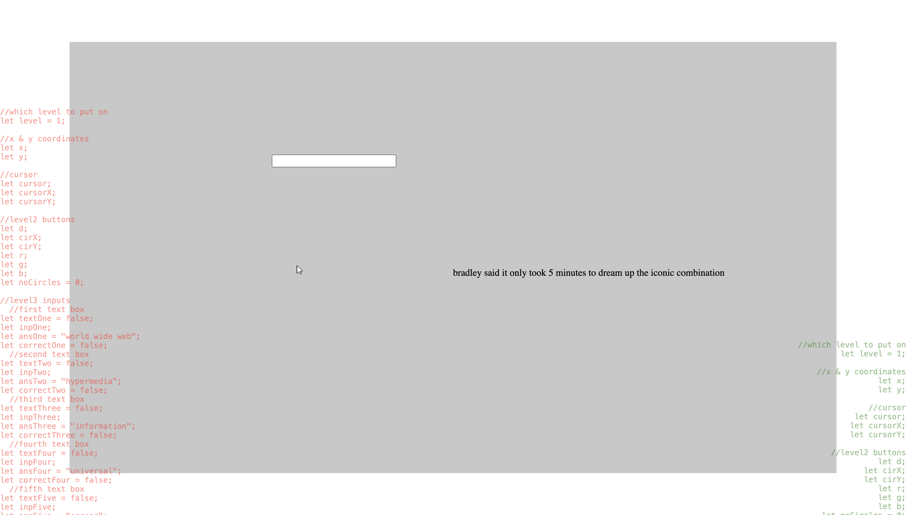

# Not What You Think Of

"Not What You Think Of" showcases a series of challenges that loops forever. Users will have to attempt to solve the problems with their keyboard and mouse. There will not be an end goal to achieve or last level to reach. Users will have to keep completing tasks to experience all the challenges available. After each tasks, there would be physical instructions that users are able to follow along if they are able to.  The option of refreshing the page is always available if users feel stuck or would like to try again.  
The main objective for the users is to experience the bodily interactions when using interfaces. They should be aware of the way they move while completing the task or following the instructions. The project aims to unlearn the muscle memories of users when using the mouse and keyboard to navigate through the interface. 

# Project Guide and Explanation AKA Cheatsheet

To complete this stage, users will have to move the cursor on the grey box and click on it.  
The cursor is inverted so that it goes against the muscle memories users have embeded in them. The two 'START' text in the middle of the page changes colours depending on the cursor's X position. The reason for this is that it may lead to users being more aware of their movements and the changes they make as they move around the cursor on screen.  
  

To complete this stage, users will have to hover the mouse cursor over the circles for several times.  
The position and colours of the circles are randomised to emphasise on the connection between the computer and the users. How the computer has power over the users' actions. The mouse cursor is also inverted in this level to make it more challenging. Numbers appear as the circles are presented. These numbers are counters for the number of mouse clicked, mouse moved, keyboard key pressed and 'DELETE' key pressed. This is to show the user visibly the actions the have made on the project, and would make them think about the physicality while using interfaces.  
  

To complete this stage, users will have to type the word shown above the textbox and repeat for each textboxes.  
In this level, the keyboard keys are remixed where the keys are in alphabetical order instead of the normal QWERTY keyboard layout. This is to break the norms of using the keyboard. The textboxes are coded on the html page rather that on the p5.js canvas. Depending on the user's screen size, the position of the textboxes may be different and would not align with the text in the canvas. Sometimes it would also block the text below it. As this was the easiest and closest way to how I want it to be, it shows that we have to code in the way that the computer understands. The theme of control now not only applies between the computer and the users but also the computer and the programmer. In addition, the words being shown are taken from the first world wide web. I did this to relate to the style that I was going for, which was the visuals of the early world wide web. Some of the elements that would , for instance, bright and vibrant colours, and the use of 'Times New Roman' as the font.  
  

To complete this stage, users will have to find the four keys that controls the movements of the mouse and move it to the end point, which is located at the bottom left using the route on the right at the start.  
Most users would assume that the end point would be at the corner of the canvas as that is how normally maze would be structured. The reason why I changed it to another part is to emphasise on the ideas and norms that is engraved in users. Also, it may lead to users realising that their actions are predictable. This could link back to the point mentioned in the essay about a trigger to digital actions in users.  
  

To complete this stage, users will have to highlight the text message then drag and drop the words into the textbox.  
In this level, users may feel the urge to use shortcut keys to complete the task. However, shortcut keys has been disabled on the project as well as the use of keyboard keys. Users would have to think out of the box and find other ways to insert the texts. The text shown on this level was taken from an article explaining how shortcut keys originated. It is very suprising that this commonly use combination of keys only took 5 minutes to be invented and now keyboard users relies on it while using a lot of different interfaces.